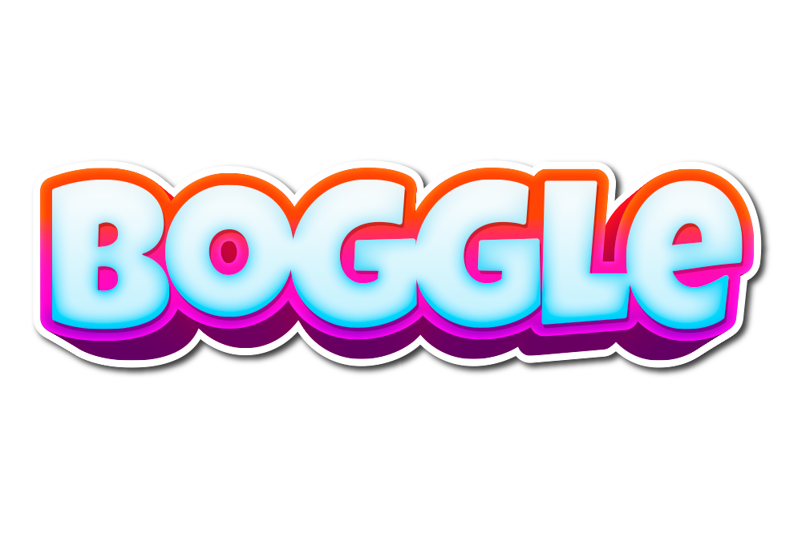

> A Boggle Game API !

<p align="center">
    <br>
    <a href="https://github.com/imskr/boggle-api/releases"></a>
    <a href="https://github.com/imskr/Rusty-Skywalker/issues"></a>
</p>
<hr noshade>

## Local Setup

*Make Sure the docker and docker-compose is installed on your local Machine. [Click Here](https://docs.docker.com/install/) to know that how to install Docker*.

- **Docker:**

  ```bash
  $ git clone https://github.com/imskr/boggle-api.git
  $ cd boggle-api
  $ docker-compose run web rake db:create db:migrate
  $ docker-compose up
  ```

  - The server is up and running at `http://localhost:3000`
